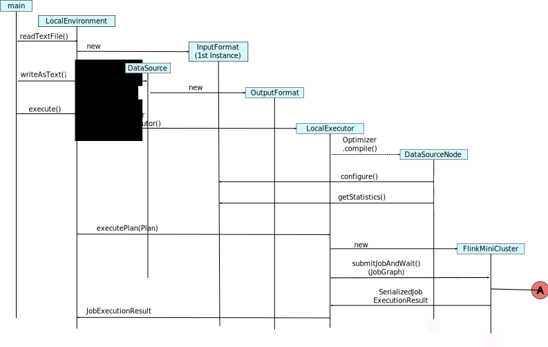

<!--
Licensed to the Apache Software Foundation (ASF) under one
or more contributor license agreements.  See the NOTICE file
distributed with this work for additional information
regarding copyright ownership.  The ASF licenses this file
to you under the Apache License, Version 2.0 (the
"License"); you may not use this file except in compliance
with the License.  You may obtain a copy of the License at

  http://www.apache.org/licenses/LICENSE-2.0

Unless required by applicable law or agreed to in writing,
software distributed under the License is distributed on an
"AS IS" BASIS, WITHOUT WARRANTIES OR CONDITIONS OF ANY
KIND, either express or implied.  See the License for the
specific language governing permissions and limitations
under the License.
-->

This document describes the processing sequence of [Local Execution](../apis/local_execution.html)

{:toc}

## Overview
There is a piece of code that loads a file, filters and write back to a file.

Cool example of what Flink is capable of.

~~~java

public static void main(String[] args) throws Exception {
	final ExecutionEnvironment env = ExecutionEnvironment.createLocalEnvironment();     // [1]
	DataSet<String> data = env.readTextFile("file:///path/to/text1.txt");   // [2]
	data.filter(new FilterFunction<String>(){                     // [3]
			@Override
			public boolean filter(String value) throws Exception {
				return value.startsWith("[ERROR]");
			}
		})
		.writeAsText("file:///path/to/output1.txt");   // [4]
	env.execute();   // [5]
}
~~~

In this document, 

## ExecutionEnvironment to FlnkMiniCluster

